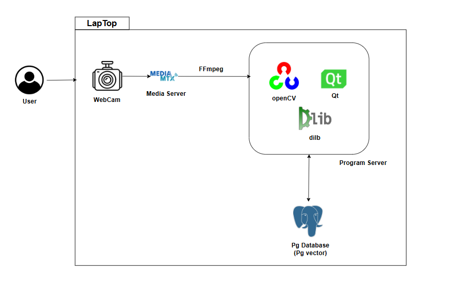
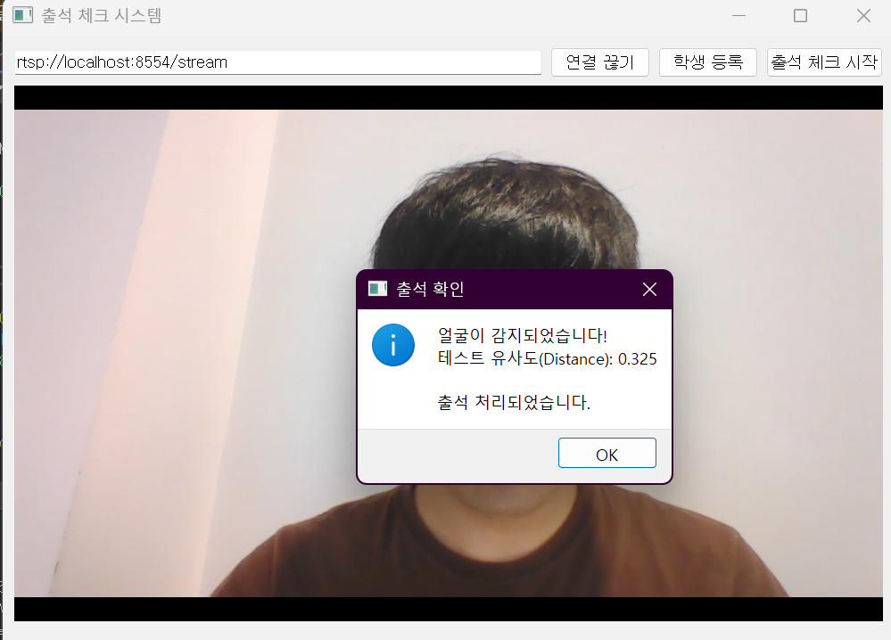

# SmartPass 프로젝트

### 프로젝트 소개

AI를 활용한 자동 출석프로그램입니다.

학교 또는 직장에서 간편하게 출석관리를 하실 수 있습니다.

학생 또는 직원분들이 WebCam에 얼굴을 인식해주시면,

AI가 자동으로 출석을 확인하고 데이터를 저장해줍니다.

### 시스템 개발 환경

1. Language: C++
2. IDE: Visual Studio 2022
3. Package: Qt5, FFmpeg, OpenCV, dlib
4. Package Manager: vcpkg
5. Build System: CMake
6. external program: WebCam, MediaMTX, FFmpeg, Postgres Database

### 시스템 아키텍처

CCTV 영상 스트리밍 플로우 (User->WebCam->Media Server->Program Server)

1. User는 노트북의 웹캠에 얼굴을 인식
2. Webcam에서 row 영상데이터 생성
3. Media Server에서 가공 및 송출 (FFmpeg 인코딩)
4. Program Server에서 가공데이터 수신

학생 등록하기 (oepnCV->dlib->Qt->Pg database)

1. openCV에서 영상데이터를 한 프레임씩 dlib(AI)로 전송
2. dlib에서 특징점 추출 및 백터값 계산
3. Qt에 User가 사용자 정보 입력 후 저장
4. Postgres DB에서 백터값 및 사용자 정보 저장

출석 체크하기 (openCV->dlib->Qt->Pg database)

1. openCV에서 영상데이터를 한 프레임씩 dlib(AI)로 전송
2. dlib에서 특징점 추출 및 백터값 계산
3. Postgres DB에서 vector값에 유사한 사용자 탐색
4. Postgres DB에 출석체크 데이터 저장

### 예시 화면

### ERD

### 보완할 점

